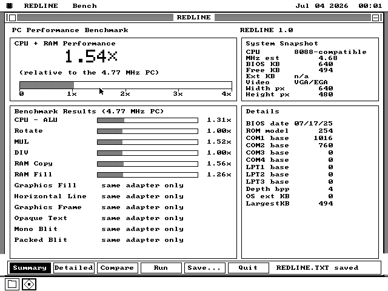
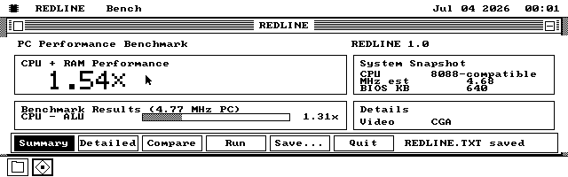
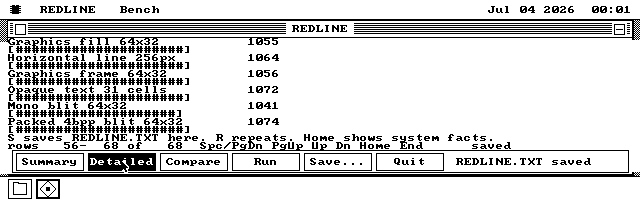

# REDLINE: research, workloads and reference PC

REDLINE is a native os8088 CPU and graphics performance lab. Build with
`make redlinedisk`, open `REDLINE.O88` from drive B:, press **R**, then **S**
to save `REDLINE.TXT`. It also ships on the everything application set.
The package uses the existing OS menus, About handler, opaque text, report
pagination and shared benchmark timing machinery. It costs no resident kernel
memory. The dedicated floppies carry the same executable in all four sizes.

Summary is the default dashboard: framed performance, system snapshot, results
and hardware-details panels, large bitmap digits, dithered comparison bars and
bottom controls. Detailed retains the complete original report, including every
inventory field, both clock estimates, raw timing counts, method flags and
numeric indices. Compare gives the bars the window's full width. Saving from
any view always writes the complete report.

Use the buttons or **U / D / C** to select Summary / Detailed / Compare; **Tab**
cycles the views. **R / S / Q** run, save and quit. **F1** opens Detailed at the
report's provenance. PgUp/PgDn page compact dashboard results or the Detailed
report; arrows and Home/End retain their report behavior in Detailed. The layout
uses the live content dimensions. CGA's short screen shows compact panels and
paged results; all facts remain available in Detailed.







## What the period software looked like

DOS tools commonly put a hardware summary, numeric scores and comparison bars
on a single text screen. Landmark had CPU, FPU and video bars, with results
relative to a reference machine. Its clock-looking values could describe
*equivalent performance*. Kingston's own accelerator installation guide says
a 20 MHz 386SLC could score around 45 MHz and distinguishes the CPU CLOCK field
from the performance bar. The board maker recommends running directly in DOS
because multitasking changes the result. [Kingston SLC/Now! guide, Appendix A](https://www.ardent-tool.com/CPU/slcnowd1.pdf)

An actual PC-SPRINT board owner's DOS captures show Landmark, Norton SI,
CheckIt, MIPS and other tools on the same NEC V20 PC, comparing stock and turbo
modes. Landmark presents CPU/FPU/video comparisons; CheckIt combines hardware
inventory and diagnostic menus with CPU, math, video and disk comparisons.
The captures are useful visual references for the dense text, menu bars,
numeric tables and horizontal bars. Version numbers and reference machines
matter: similarly named scores need not share a scale.
[PC-SPRINT owner's screenshots and measurements](https://github.com/reeshub/pc-sprint#my-benchmarks)

Windows 3.1 tools added ordinary Windows title bars, menus, dialogs and reports.
WinTach's main dialog groups Word Processing, CAD/Draw, Spreadsheet and Paint
beside CPU/display/driver/color-depth facts, with a relative performance result
below. A contemporary graphics-card review reproduces the WinTach screen and
runs WinTach, WindSock and WinBench at different color depths, obtaining different
rankings. [1994 review and WinTach screen, Popular Electronics](https://www.worldradiohistory.com/Archive-Poptronics/90s/94/PE-1994-11.pdf)

WinBench 3.11 measured the Windows graphics stack, not just writes into video
RAM. A preserved *actual program report* enumerates arcs, lines, pixels, region
fills, monochrome/color BitBlt, alignment, raster operations, DIB conversion,
stretching and text/font combinations. It records the driver, resolution,
color depth and running tasks. It reports Graphics WinMark in millions of
pixels/second and Disk WinMark in thousands of bytes/second; the component
results remain visible separately. These units are specific to its test mix.
[WinBench 3.11 report comparing Windows 3.1/3.11](https://groups.google.com/g/comp.os.ms-windows.apps/c/s3hOxHkJOsc)

REDLINE borrows those hardware facts, workload tables and comparison bars.
It measures os8088's graphics API rather than pretending to produce a WinMark,
a Norton SI score or a Landmark equivalent MHz. Disk and FPU throughput are
outside this package's CPU/graphics scope; FPU *presence* is still reported.

## What REDLINE tests

Every machine runs identical work and iteration counts. The count column is
net PIT counts; `us/op` is per complete body, **not per instruction or pixel**.

| Workload | Work per body | Bodies per row |
|---|---|---:|
| ALU | 128 chained ADD/XOR pairs | 64 |
| Rotate | 128 register rotations by four bits | 64 |
| Multiply | 64 fixed 16-bit multiplies with operand reload | 64 |
| Divide | 64 fixed 32/16-bit divides, bounded quotient | 64 |
| RAM copy | 2,048 bytes with REP MOVSW | 32 |
| RAM fill | 2,048 bytes with REP STOSW | 32 |
| Rectangle fill | OS API, 64x32 pixels | 24 |
| Horizontal line | OS API, 256 pixels | 64 |
| Rectangle outline | OS API, 64x32 pixels | 24 |
| Opaque text | 31 cells, letters/digits/punctuation | 16 |
| Monochrome blit | 64x32, alternating bit pattern | 32 |
| Packed-color blit | 64x32, uniform color 1 | 16 |

Graphics include the renderer, API arrival and video bus. They operate only
inside the benchmark window; no raw VRAM writes escape into neighboring windows.
RAM buffers are package-owned. Register-heavy rows still include instruction
fetch and setup. The comparison is per workload: `1000 = baseline`, larger is
faster, and 20 `#` marks represent the reference PC. Bars cap at 50 blocks;
the numeric result retains its range. VGA/Hercules still produce timings;
CGA reference graphics indices are withheld on those adapters.

The Summary headline is the arithmetic mean of the six CPU/RAM indices, each
equally weighted, labelled **CPU + RAM Performance**. It is a convenience for
this fixed mix, not a universal score, and never incorporates graphics from
another adapter. Graphical bars reach full width at 4x; numeric ratios retain
their values up to 99.99x, above which they show `>99.9x`. Detailed and saved
reports retain full numeric indices. Unresolved timings have no invented score.

`tests/benchlib.inc` is the single shared timer/report implementation, also used
by GFXBENCH/SYSBENCH. It latches PIT channel 0 without changing its programming,
subtracts the empty-body measurement, accumulates in 32 bits and services IRQs
between bodies. A flagged `t`/`w` row used coarse ticks because a body outgrew
the PIT interval; such a run should not be treated as a high-resolution score.
The screenshot/report formatting and disk saving happen outside measured spans.

## CPU identity, MHz and RAM: what can be known

The existing OS tier gates all newer opcodes. On early CPUs, REDLINE checks
shift-count masking, the repeated-string restart defect, and the prefetch queue.
The NEC test requires an observed timer interrupt, so an uninterrupted operation
cannot prove NEC. Self-modified instruction bytes and FLAGS are restored on every
run. The historical techniques and their assumptions are described alongside
original source in [Cosmo's processor detection analysis](https://cosmodoc.org/topics/processor-detection/).

386+ probes test AC and ID before using CPUID. The report includes vendor,
family/model/stepping, signature, feature bits and the brand string where
available. Cyrix and both Transmeta vendor spellings are recognized. Early
Intel-compatible/AMD/IBM parts without unique public identification cannot
always be told apart. The DIV-flags fingerprint identifies a Cyrix/TI-compatible
behavior, not an exact model. REDLINE never enables disabled CPUID or writes
CPU configuration ports. [Linux's Cyrix detection and configuration code](https://github.com/torvalds/linux/blob/v4.4/arch/x86/kernel/cpu/cyrix.c)

Clock sources stay distinct: CPUID leaf 16 gives **nominal CPU MHz**; a timed
TSC gives **TSC MHz**. An invariant TSC, turbo or Transmeta translation can
make that differ from the core clock. Intel explicitly says leaf 16 is
specification information rather than a measurement. For pre-TSC 808x/286/386
classes, MUL and DIV yield separate book-timing estimates. Unsupported families
say clock unavailable. Raw timings and indices remain useful.
[Intel processor-frequency semantics](https://cdrdv2-public.intel.com/874239/252046-082-sdm-change-document.pdf)

Conventional RAM is INT 12h's firmware report. E820 sums firmware type-1 usable
ranges when available; it excludes reserved memory and is not a DIMM inventory.
Fallback INT 15h/AH=88h extended KB can cap at 15/64MB. No result is invented if
firmware declines. OS free RAM, largest conventional run and free extended KB
are separate queries. BIOS date/model, equipment word, COM/LPT bases, OS
FPU presence and the window's actual adapter/geometry round out the inventory.

## The 4.77 MHz reference

`os8088_redline_pc` is an IBM 5150 with a user-supplied IBM ROM.
`os8088_redline_pc_gla` uses bundled GLaBIOS and is runnable from a clean checkout.
Both have the machine type's Intel 8088 at `(315/22)/3 = 4.772727… MHz`, 640KB
conventional RAM, zero RAM wait states, dynamic CGA, two 360KB drives and a
serial mouse. The launcher configuration has **turbo=false**. No sound card,
CPU upgrade, RAM upgrade overlay or disk accelerator is present.

MartyPC's CPU models prefetch, bus activity and instruction timing and is
validated against physical 8088 instruction tests. That supports an accurate
reference, but **cycle perfect physical PC equivalence is not a guarantee**:
the upstream README publishes residual discrepancies, and peripheral/ROM
choices matter. NEC timing is explicitly not equally accurate.
[MartyPC accuracy and device support](https://github.com/dbalsom/martypc)

```
make marty redlinedisk build/os8088-360.img
python3 tools/redline_profile.py
# with your IBM BIOS dump installed:
python3 tools/redline_profile.py --machine os8088_redline_pc
# deliberately regenerate the shipped reference:
python3 tools/redline_profile.py --calibrate
make redlinedisk
```

The runner drives genuine UI commands, executes three complete runs, checks the
CPU/RAM and timing results, saves the guest file and extracts it through the
independent FAT reader. Reference counts are each workload's median; retained
trials expose variation from refresh, beam phase and timer quantization.
`apps/redline/reference.json` records the measured package/kernel/emulator/BIOS
hashes, machine/config and emulator pin. `baseline.inc` contains those actual
counts. Calibration changes the package's embedded reference; the measured
image hash therefore describes the calibration input, not the rebuilt output.
Keep the two distinct when auditing provenance.

Host results and screenshots land in `build/redline-profile/`. The emulator
reference has not been validated on physical 8088/NEC/Cyrix/Transmeta machines.
The package should report what is reliably queryable on those machines rather
than claiming untested exact model identification.

## Validation

`tests/redline.py --host` independently walks all four FAT12 media, matches the
package and checks reference counts against the assembled workload hash.
`--machine os8088_redline_pc_gla` runs and saves the native report twice, checks
reference indices and executes large-denominator arithmetic on the 8088.
The Hercules and VGA machines exercise the same UI and withhold CGA graphics
indices. Native checks also verify the six-row headline calculation, view
switching, held-button behavior, slide-off cancellation, Detailed End/F1
navigation, compact result pagination and the Quit button. `--modern` boots
the shipped probe code under QEMU BIOS for guarded
286-class/486 paths, Pentium/Pentium III, E820 RAM and TSC measurement. Cyrix
and Transmeta cases use CPUID vendor overrides, not those physical processors.

`--nec` executes the shipped early CPU probe twice on MartyPC's V20 with a
minimal real PIT/IRQ0 harness. The pinned emulator's V20 configuration stalls
in BIOS POST before the os8088 desktop; this isolated test validates NEC
identity and restoration of self-modified code, not a native V20 OS run or
NEC cycle timing. The V20 profile is for probe testing, never calibration.
