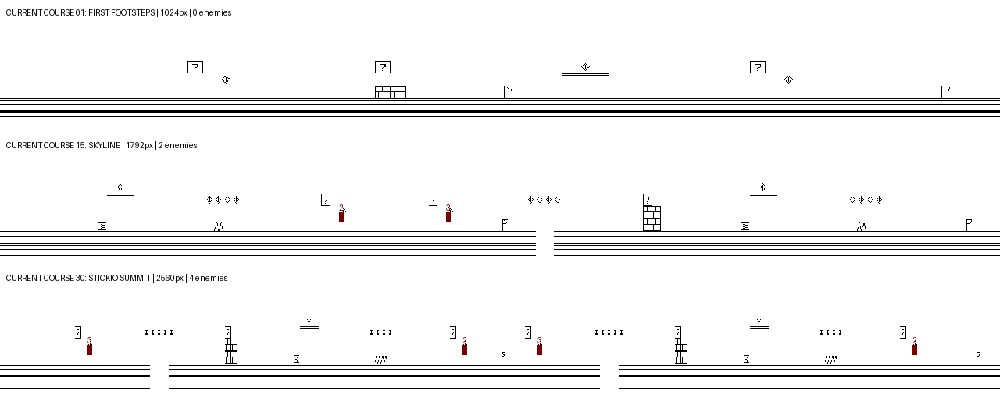

# Stickio feature gaps and Super Mario Bros inspired development plan

Status: P0 foundations implemented; P1–P3 remain proposed. Original review on 2026-09-30 used commit `b83c1dc4` and the supplied `smb.nes`. The baseline and reference analysis below describe that review; current P0 behavior is documented in SPEC.md section 103 and the Stickio README.

P0 delivers named local constants, an independent integer player model with 365
per-step guest comparisons, versioned single-room course authoring with a
deterministic assembly fixture, compiler limits/manifests/previews, terrain-aware
walkers and hoppers, authored flyer height, explicit checkpoint x/y, and consumed
tile/enemy-reward ledgers. Existing thirty-course layouts and movement tuning
remain. Compiler and runtime checks cover support heights, wall/edge policies,
one-way support, pit retirement, actor overflow and retry payouts. Byte and live
timing ledgers are generated under `build/stickio-proof/`. Linked rooms, enhanced
forms, speed-sensitive jumps, shells and first-world redesign remain later waves;
the foundation traces do not certify course completion or human playability.

Stickio has a useful platforming foundation. Its next improvement should make movement, enemies, rewards, and terrain interact: a stomp creates a shell, the shell clears a dangerous passage, a block grants a new ability, and a secret leads to a different route. Adding those decisions to deliberately composed courses will do more for engagement than increasing course length or enemy counts.

The recommended first release is a rebuilt five-course opening world with tuned movement, interactive blocks, protective and projectile power-ups, shells, timed ambush enemies, moving platforms, one bonus room, and a world finale. Expand the remaining twenty-five courses after that world passes playability and XT performance gates. Retain Stickio's original monochrome identity and existing desktop, input, and sound integration.

## Evidence and scope

### What was inspected

| Evidence | What it establishes |
|---|---|
| [`apps/stickio/game.inc`](../../apps/stickio/game.inc) | Current movement, collision, rewards, enemy logic, checkpoint reload, and completion behavior. |
| [`apps/stickio/stickio.asm`](../../apps/stickio/stickio.asm) | Controls, session flow, clock/catch-up behavior, and BSS allocations. |
| [`apps/stickio/video.inc`](../../apps/stickio/video.inc), [`audio.inc`](../../apps/stickio/audio.inc) | Terrain caching, sprite capacity and clipping, HUD, music, and sound routes. |
| [`tools/stickio_assets.py`](../../tools/stickio_assets.py) | Actual course construction, enemy placement, original art, and music compilation. |
| [`tests/stickio.py`](../../tests/stickio.py), [`tests/stickio_display.py`](../../tests/stickio_display.py) | Existing checks and the distinction between structural validation and completing a course. |
| [`SPEC.md` section 103](../../SPEC.md), [`PERFORMANCE.md` Set 156](../../PERFORMANCE.md) | Current contract and previously measured emulator costs. |
| Local `smb.nes` | Header, area tables, code bytes, and execution of its player jump setup routine. |

The supplied file is 40,976 bytes: a 16-byte NES 2.0 header, 32,768 bytes of program ROM, and 8,192 bytes of character ROM, mapper 0, no trainer. Its SHA-256 is `0b3d9e1f01ed1668205bab34d6c82b0e281456e137352e4f36a9b2cfa3b66dea`. Its full-file CRC32 is `393a432f`. The different header means it should not be identified solely by the checksum of another published iNES file.

The displayed program bytes in [doppelganger's disassembly, converted by Andy McFadden](https://6502disassembly.com/nes-smb/SuperMarioBros.html) were compared to the local program ROM: **26,309 distinct byte positions matched, with zero mismatches**. Abbreviated data in the listing was excluded from that comparison. This supports using its labels for the inspected routines and tables; it is not a complete binary identity check. Nintendo's [original instruction booklet](https://www.nintendo.co.jp/clv/manuals/en/pdf/CLV-P-NAAAE.pdf) supplies the intended player-facing controls and item rules.

Study outputs are local, ignored artifacts under `build/stickio-smb-study/`: `analysis.json`, cached reference text, and a course montage. The montage below contains only current, original Stickio terrain; red markers identify its enemy types.



The study executed SMB's jump setup at `$B450` using the installed `py65` CPU interpreter with synthetic RAM and inputs. It did not run a full NES emulator or play through either campaign. Movement ranges below are calculations from Stickio's source, not measured human success rates. Existing frame rates and screenshots are repository evidence, not fresh hardware measurements. `make stickiocheck` was rerun and passed during this review.

### Reference boundaries

The reference is the original NES Super Mario Bros. Mechanics such as shell carrying, slopes, wall jumping, a world map, and contemporary Mario movement assists are not SMB1 requirements. Nintendo describes its central environments as caves, castles, and pipe-connected areas; these provide useful variety for this plan. [Nintendo game description](https://www.nintendo.com/en-gb/Games/NES/Super-Mario-Bros-803853.html)

All implementation proposals below are design choices for Stickio. Use original course layouts, characters, scenery, music, and code. The shipping build should continue to work without `smb.nes`, a network connection, or the reference disassembly.

## Current gameplay baseline

Stickio already provides acceleration and friction, walk/run speeds, jump release for shorter jumps, five-step jump buffering and coyote time, stomp bouncing, springs, one-way ledges, pits, spikes, thirty course names, six music themes, a midway checkpoint, finite lives, and fullscreen restoration. These systems should be extended rather than replaced wholesale.

Its courses are generated by `courses()`, which places a motif every twelve columns and selects `(j+n)%6`. Courses are deterministic, but they share this grammar and the same ten tile types. World difficulty primarily changes width, gap width, obstacle height, and enemy selection. There are no alternate areas or environment-specific movement rules.

| World | Course lengths in pixels | Enemies per course | Enemy types actually used |
|---|---|---|---|
| 1 | 1,024–1,280 | 0, 2, 2, 2, 2 | Walker |
| 2 | 1,280–1,536 | 2, 3, 2, 2, 2 | Walker, hopper |
| 3 | 1,536–1,792 | 3, 3, 2, 2, 2 | Walker, hopper, flyer |
| 4 | 1,792–2,048 | 3, 4, 3, 1, 1 | Walker, hopper, flyer |
| 5 | 2,048–2,304 | 3, 4, 4, 3, 2 | Walker, hopper, flyer |
| 6 | 2,304–2,560 | 4, 4, 4, 4, 4 | Walker, hopper, flyer |

The first course has no enemies. All three types die from a qualifying descending stomp and award 25 points; side contact spends a life unless the player has respawn invulnerability. Walkers and hoppers move at one integer pixel per simulation step and use hard-coded support probes at y=95/97 and a base y=72. They cannot naturally patrol raised terraces or fall between platforms. Flyers follow a triangular vertical wave. Adding more spawn records alone will not produce rich encounters.

Question blocks give one coin and become the ordinary brick tile. Bricks are permanently solid. There are no emerging items, enemy damage from bumped blocks, hidden blocks, shell interactions, projectile attacks, or player power states. Coins add ten points; fifty coins award a life, capped at nine. Score is tracked but is not displayed by the current HUD.

Death calls `st_load`, reconstructing the whole map and enemy array while retaining score and coins. Collected rewards therefore return. Any new bonus-room or checkpoint implementation must explicitly define persistence and prevent repeatable reward farming.

## Feature gap analysis

Priorities: **P0** enables safe implementation; **P1** belongs in the improved first world; **P2** expands the campaign; **P3** is optional parity or polish. “Partial” means some underlying capability exists, not that the experience is equivalent.

SMB comparison entries describe behaviors established by the inspected ROM, its labeled routines, and the original booklet. The proposed adaptation and its priority are judgments for Stickio.

| Feature | SMB reference behavior | Stickio gap | Proposed adaptation | Priority |
|---|---|---|---|---|
| Acceleration and braking | Momentum and direction-dependent friction | Partial: one acceleration law on ground and in air; no skid pose | Separate ground braking and air steering; add skid feedback | P1 |
| Jump profile | Speed selects jump and fall parameters | Partial: one launch/gravity profile at all speeds | Tune speed-tiered ascent and descent in Stickio units | P1 |
| Jump release and input | Button state affects jump duration | Present, with extra buffering/coyote assistance | Preserve assists; verify short taps and running jumps | P1 |
| Camera | Forward progression and constrained backward travel | Different: camera follows both directions | Keep exploration; add dead zone and forward visibility | P1 |
| Enemy support physics | Ground actors move over terrain with species differences | Partial: fixed-height patrols | Terrain-aware support and falling; distinct edge policies | P0 |
| Shell combat | Stomp, stationary shell, kick, moving shell, recovery | Missing | Original armored enemy and reusable shell state machine | P1 |
| Enemy defenses | Species differ in stomp and projectile vulnerability | Missing: uniform stomp result | Traits for stompability, armor, spikes, and projectile resistance | P1/P2 |
| Timed ambush | Pipe enemies emerge with proximity-dependent behavior | Missing | Retracting ink creature at a clearly marked opening | P1 |
| Ranged enemies | Cannons and throwers create projectiles | Missing | Telegraphs, projectile lanes, cover, and bounded pools | P2 |
| Flying transformations | Some winged enemies lose flight after a stomp | Missing | A winged sheller becomes a ground sheller | P2 |
| Aquatic enemies | Fish and pursuing swimmers alter underwater encounters | Missing | Original swimmers paired with a distinct swim mode | P2 |
| Pressure spawners | A flying enemy introduces falling hazards | Missing | Short scripted spawner sections with a strict object cap | P3 |
| Protective growth | Power-up allows surviving a hit; size affects movement space | Missing | Protection first; physical size change assessed separately | P1/P3 |
| Projectile ability | Powered player can launch bouncing shots | Missing | Two-shot ink projectile pool; run key also attacks on press | P1 |
| Temporary invincibility | Timed offensive protection from an item | Partial: respawn protection only | Separate offensive buff, visual countdown, music cue | P2 |
| Reward blocks | Items, repeated coins, hidden rewards | Partial: one coin, visually reused brick | Distinct spent block, emerging items, multi-coin and secret blocks | P1/P2 |
| Brick interactions | Bumping and breaking affect blocks and enemies | Missing | Block bump impulse; empowered breaking and shell hits | P1 |
| Bonus routes | Pipes and vines link areas | Missing | Explicit entrances, a bonus room, return coordinates, climbing later | P1/P2 |
| Moving terrain | Platforms move, fall, lift, or balance | Missing | Horizontal/vertical carriers first; falling/balance variants later | P1/P2 |
| Castle hazards | Lava and rotating hazards demand timing | Missing | Original foundry hazards using precomputed motion | P1/P2 |
| Boss finales | Castle encounter and bridge-ending sequence | Missing: final course ends at the same flag | One reusable boss framework and switch-operated escape | P1/P2 |
| Level composition | Specific introductions, combinations, and finale sequences | Partial: repeating motif grammar | Explicit authored sections with challenge/recovery pacing | P1 |
| Environment variety | Area types change terrain, enemies, and movement | Partial: world names and music differ | Surface, underground, elevated, water, and foundry course roles | P2 |
| Discovery | Hidden blocks and alternate destinations reward experimentation | Missing | Optional secrets with readable clues and guaranteed returns | P2 |
| Timer and urgency | Countdown, warning, and remaining-time score | Missing | Simulation-clock timer in an optional challenge mode | P2 |
| Scoring skill | Stomp/shell chains and finish position change reward | Partial: flat scores | Combo scoring, finish-height reward, visible score | P1/P2 |
| Course end presentation | Flag descent, walk, tally, or castle sequence | Partial: instant message and Enter | Short interruptible celebration and readable tally | P1 |
| Checkpoint rules | Course-dependent midpoint/restart behavior | Different: every course has a midpoint flag | Keep forgiving checkpoints; save safe state explicitly | P0/P1 |
| Progress and replay | World/course sequence, title demonstration, harder replay | Partial: selectable course and session-only progress | Unlocks and per-course records; attract/harder replay later | P2/P3 |
| Alternating players | Two-player turns | Missing | Defer until single-player campaign and state isolation are stable | P3 |
| Contextual sound | Music and effects reflect events and environment | Partial: six themes and five effect families | Item, shell, warning, boss, secret, and clear cues | P1/P2 |

### What matters most for engagement

The highest-value loop is **movement → interaction → reward → a new choice**. A shell is both an enemy consequence and a tool; a power-up changes risk; a moving platform changes timing; a secret changes route. Implement these relationships before adding decorative enemy variants.

Course composition is equally important. A safe first encounter teaches a mechanic, a second encounter changes terrain, and a third combines it with one previously learned behavior. Put recovery space and optional rewards between demanding sequences. Longer uninterrupted obstacle chains do not automatically make a course more engaging.

## Movement and collision plan

### Baseline and tuning targets

Current source values at approximately 54.62 steps per second:

| Parameter | Current value |
|---|---|
| Walking / running cap | 448 / 768 in 8.8 velocity; 1.75 / 3 pixels per step |
| Acceleration / passive friction | 48 / 64 in 8.8 velocity per step |
| Jump launch / gravity / fall cap | −1664 / +96 / +1536 |
| Early-release upward cap | −640 |
| Stomp / spring launch | −1152 / −2176 |
| Buffer / coyote duration | Five steps, about 92 ms |
| Respawn protection | Ninety steps, about 1.65 seconds |
| Full held jump on unobstructed level ground | Calculated 34 steps; 53.125 pixels of rise |
| Range at constant walk / run cap | Calculated 59.5 / 102 pixels, before body overlap and landing margins |

These ranges assume constant horizontal speed and no obstacles. They are not a certificate that a three-tile gap is safe under every approach.

The local SMB routine selected initial vertical speed −4 and ascent/fall force 32/112 at speed magnitude 0, −4 and 30/96 at magnitude 16, and −5 and 40/144 at magnitude 25. These are SMB's own units, not Stickio constants. They demonstrate that a speed-sensitive jump is a real reference behavior. [Reference routine and tables](https://6502disassembly.com/nes-smb/SuperMarioBros.html)

Proposed tuning procedure:

1. Move existing constants into a local `const.inc`; describe their units and update SPEC.md section 103 before changing the contract.
2. Implement a host model of Stickio's actual step order and rounding. Compare every step with the guest for acceleration, reversal, short/full jump, ceiling hits, and edge departure.
3. Evaluate three speed bands with separately tunable ascent and descent parameters. Match useful control relationships and travel in tiles per second; do not transplant 60 Hz constants into the 54.62 Hz loop.
4. Keep buffering and coyote time. Preserve held-Z behavior and support taps between presentations. Give airborne reversal a deliberate, testable response.
5. Add skid and block-bump feedback, then test a small set of jump courses before fixing gap lengths across the campaign.

Adopt a bounded camera dead zone, initially keeping the player approximately 104–136 pixels from the left edge during forward travel. These are proposed starting values. Evaluate visibility with the fastest shell and projectile, clamp to room bounds, and allow backward exploration without rapid oscillation. Retain four-pixel rendering alignment initially.

### Collision foundations

Replace hard-coded player/enemy probes with named body bounds and terrain queries. Ground enemies need vertical velocity, support contacts, and an authored initial position. Walkers may fall from edges; cautious shellers turn; hoppers launch from their actual support height. Differentiate solid terrain, one-way support, hazardous material, and triggers.

Use previous/current positions to resolve crossed surfaces and fast object collisions. Resolve a landing once, and decide stomp versus side damage from previous feet and enemy top rather than only current overlap. Cover shells crossing an enemy in one step, narrow walls, block corners, moving-platform attachment, and overlapping hits.

Use a defined simulation order: read input; advance platforms; apply carried displacement; advance player/actors/projectiles; resolve terrain; resolve actor contacts; apply queued rewards/damage/transitions; update camera/audio. Queue object removal and room transitions so they cannot invalidate an actor loop midway through a step.

## Enemies and interaction design

Names below are working names for original Stickio creatures. Types should differ in what the player must do, and silhouette should communicate that behavior in black and white.

| Role | Behavior and interactions | Encounter use | Delivery |
|---|---|---|---|
| Walker | Existing basic creature; terrain-aware, falls from ledges, stompable | Safe first stomp; later pit or block combinations | First world |
| Hopper | Existing creature; visible crouch and terrain-based launch | Timing against low ceilings or platform landings | First world |
| Flyer | Existing creature; authored patrol center and range | Air-lane choices; avoid a landing zone | First world |
| Roller | Armored patrol; stomp retracts it; touching resting shell from the side kicks it | First emergent combat tool | First world |
| Cautious roller | Roller that turns at exposed edges | Raised terraces and predictable shell setup | Campaign |
| Ink sprout | Retracts into an opening; pauses emergence when player is close | Stop-and-go crossing and bonus entrance tension | First world |
| Thornback | Visibly spiked, unsafe to stomp; vulnerable to chosen ranged/shell attacks | Teach that not every enemy is a jump target | Campaign |
| Darter | Cannon-launched horizontal projectile with a visible cue | Jump timing and sheltered waiting areas | Campaign |
| Slinger | Alternates wind-up, throw, and recovery; bounded ballistic shots | Cover and approach choices | Campaign |
| Winged roller | Predictable flight; stomp removes wings, second stomp retracts | Multi-step encounters and elevated routes | Campaign |
| Swimmer | Fixed patrol or short pursuit in water; no ordinary underwater stomp | Navigation through changing lanes | Water wave |
| Ember jumper | Periodic arc from a hazardous opening; landing cannot be used as support | Foundry timing | Campaign |
| Cloud scribe | Short section spawner of falling thornbacks | Late-game pressure with an escape route | Optional |
| Foundry keeper | Telegraph, attack, recovery; defeat by a reachable switch or powered attack | World finale with two solutions | First world framework |

The roller state machine is `patrol → retracted → kicked → retracted`, with a timer from retracted back to patrol and explicit defeated/falling states. Stomping a moving shell stops it; side contact with it hurts. Recovery has an advance warning. Shells bounce off suitable walls, hit blocks, defeat vulnerable actors, and accumulate a bounded combo. **SMB1-style carrying is not required.**

Give each type a small trait record: body bounds, support policy, stomp response, shell vulnerability, projectile vulnerability, contact damage, and animation set. Implement behavior dispatch locally rather than building a general scripting VM. A projectile-resistant armored variant is useful only after the basic projectile interaction is understood.

Replace the current “first six nearby records step” rule with an explicit activation policy. Author spawn positions and stable IDs; activate before entering the visible field; preserve state while nearby; retire objects at defined bounds. If a pool is exhausted, defer a spawn or flag invalid content. Never silently freeze a visible hazard or draw an actor that is not being simulated.

## Blocks, powers, rewards, and secrets

For the first world, use three player states: fragile, reinforced, and projectile-enabled. A damaging enemy hit consumes the enhanced state before costing a life. Separate post-hit protection, respawn protection, and offensive invincibility so their damage rules cannot accidentally overlap. Falling out of the world remains lethal. Decide spike/lava behavior explicitly and teach it visually.

The first implementation should preserve the current 16×24 body and communicate reinforcement through an original accessory and pose. This transfers the protection/progression mechanic while avoiding an immediate expansion of every sprite and collision path. Physical growth, small-body clearance, and crouching remain a P3 parity option; they require new art, variable collision bounds, safe standing checks, and retested routes. Same-size protection is a deliberate adaptation, not full size parity.

Use X/Shift as held run plus an edge-triggered shot when projectile-enabled, reflecting the reference's shared run/attack control. The press must still accelerate normally, a held key must not fire every step, and buffered attack taps must survive low presentation rates. Start with a two-projectile pool, bounded lifetime, bouncing ground contacts, and explicit enemy resistance.

Add block content independent of visual tile identity: single coin, multi-coin, reinforcement, projectile upgrade, extra life, temporary invincibility, or secret trigger. Introduce a distinct spent-block tile. Bumps affect actors standing on the block; empowered brick breaking removes support; shells can trigger or break designated blocks. Compile brief block/item motion instead of invalidating the whole terrain for every animation frame.

Keep Stickio's fifty-coin life threshold initially. Display score and an upgrade indicator, add stomp/shell chain rewards, and use a wide enough score representation to prevent wraparound during a long campaign. Optional challenge mode adds finish-height and remaining-time rewards. Bound bonus-life chains to avoid uncontrolled life inflation.

Each new secret should have a discoverable clue: a coin trail, a patterned wall interruption, an unusually placed block, or a visible ledge. The first world needs one bonus room entered through a marked opening, with a deterministic return point. Later add hidden blocks, a climbing route, and an optional world shortcut. Main-path completion must never depend on finding a secret.

## Course authoring and campaign structure

### Authoring format

Replace `(j+n)%6` as the source of shipping courses with explicit, versioned course files, proposed under `apps/stickio/levels/`. Keep the host compiler, deterministic build, and column-major RLE runtime map.

A course declares ID/name, world, environment, room IDs and dimensions, spawn, checkpoint policy, exit condition, music, optional challenge time, sections, terrain, objects, block contents, and links. Each room declares legal destinations and safe arrival rectangles. Reusable motifs remain authoring helpers, but authors choose their order, spacing, height, rewards, and combinations.

Enforce a protected arrival zone, legal object counts, valid links, reachable exit trigger, and checkpoint support. Compile an object/content manifest and overhead layout preview for review. Separate decoration from collision so adding scenery cannot change the rules accidentally.

### Five-course opening world

Lengths and timings are starting authoring targets. The first implementation may adjust them after movement tuning. Existing course names can be retained even as layouts change.

| Course | Intended experience | Key sequences | Required exit proof |
|---|---|---|---|
| First Footsteps | Learn movement, stomp, reinforcement, and reward | Safe first walker; block with a recoverable upgrade; small pit; rewarded high route; short combined encounter | Fragile walking route is completable; missing the upgrade never traps the player |
| Brick Hop | Underground blocks, shell discovery, and a bonus room | Raised patrol; safe first roller; shell clears two walkers; marked entrance; room return; brick staircase | Complete without shell use or a projectile upgrade; return preserves progress |
| The Ditch | Elevated movement and carried platforms | Stationary ledges; one horizontal platform; flyer crossing; two timed landings; safe checkpoint | Both platform approach phases have a valid crossing; no unavoidable offscreen hit |
| Spring Street | Timing and alternate solutions | Spring preview; sprout near an opening; hopper below a ledge; optional upper reward; speed-based finale | Short/full jump choices are readable; spring return and retry are safe |
| Meadow March | First foundry finale | Telegraph hazard; roller/brick combination; recovery platform; keeper encounter; accessible escape switch | Fragile player can win using the switch; powered route also works |

Example rhythm for First Footsteps, proposed length 1,280 pixels:

| Span | Main route | Optional decision |
|---|---|---|
| 0–192 | Run-up, one block, safe landing floor | Practice tapping versus holding Z |
| 192–384 | One approaching walker and room to recover | Stomp for a coin clue |
| 384–576 | Reinforcement block and raised step | Take reward above the safe route |
| 576–736 | Checkpoint and quiet landing zone | Observe the next challenge |
| 736–960 | First pit with a visible far edge | Run jump to the higher coin route |
| 960–1,152 | Previously taught step plus walker | Use the high route or clear the floor |
| 1,152–1,280 | Exit approach and brief celebration | Aim for a higher finish reward later |

This spacing is a blueprint to test, not a proven jump layout. Build every span from the measured movement envelopes and actual enemy timing.

### Six-world campaign

Keep thirty courses, six worlds, and a five-course cadence: introduce, change context, emphasize traversal, combine, conclude. The environment names are proposed identities; art stays original and monochrome.

| World | Courses one through five | New emphasis |
|---|---|---|
| Meadow | Movement surface; underground blocks; elevated platforms; springs/ambush; foundry keeper | Core interactions and one secret |
| Ink Works | Sprout passages; cautious rollers; carrier platforms; cannon introduction; furnace finale | Timing and shell placement |
| Paper Heights | Vertical platform route; winged rollers; falling ledges; slinger/cover route; elevated keeper | Air lanes and recovery choices |
| Deep Lines | Underground exploration; first water course; hidden climbing route; water/land transition; cavern finale | Movement mode and linked areas |
| Clockwork | Lift sequence; rotating hazard; projectile-resistant patrol; optional balance route; mechanism finale | Timing combinations and alternate solutions |
| Last Ascent | Mixed traversal; water revisited; shell mastery; final gauntlet with recovery; summit keeper | Mastery with clear checkpoints |

Every world should have an original landmark, a distinct hazard emphasis, an optional discovery, and a concluding encounter. Reuse the boss machinery with different terrain and attack patterns rather than implementing six unrelated bosses. Underwater motion and balance platforms follow dedicated collision/performance gates; if they fail, ship alternative dry traversal courses and record the remaining parity gaps.

### Difficulty rules

Introduce an unfamiliar enemy or hazard in isolation before combining it. Do not use color as its only warning. Leave enough visible approach distance for the actor's speed and player braking time. A missed moving platform should normally provide a recoverable lower route in early courses.

Test the main route in the weakest player state and without secrets. Test required gaps from their real run-up, including a buffered input arriving between renders. Reserve fully committed running jumps and constrained landing windows for later courses. Main-path challenges must respect the slowest supported presentation rate.

Place checkpoints after meaningful learned sequences rather than automatically at `width//2`. A checkpoint snapshot specifies room, x/y, safe support, player form policy, and reward state. A boss checkpoint must not reopen into an active projectile or hazard.

## Engine changes and resource limits

### Local modules and data

| Proposed change | Location and responsibility |
|---|---|
| Constants and body/trait definitions | New local `apps/stickio/const.inc`; contract in SPEC.md section 103 |
| Player movement and collision | Extend `game.inc`, splitting into local includes when useful |
| Actor states and bounded pools | Local actor include; stable spawn IDs, support, shells, projectiles, items |
| Course and room state | Local world include; checkpoints, transitions, content ledger, exits |
| Original authored courses | `apps/stickio/levels/`, compiled by `tools/stickio_assets.py` |
| Sprite and terrain composition | Extend `video.inc` and the existing cached RAM path |
| Contextual audio | Extend `audio.inc` through existing OS sound calls |
| Independent simulation and authoring checks | Proposed `tools/stickio_sim.py`; guest tests remain in `tests/` |

Reuse the existing FSX bracket, key-state API and buffered BIOS input, rate hook/fallback, duration-leased sound, OPL2 voices, and optional DMA effect path. New gameplay belongs in the package; it does not require a kernel interface or private IRQ. Preserve 8086 instruction compatibility and operation on the small kernel.

### Memory gate

Current host check: **38,696 image + 14,911 BSS = 53,607 bytes**. The current test requires image+BSS below 61,440, leaving 7,833 bytes to that boundary. This is a checked package bound, not a promise that all remaining bytes are safe to spend without examining stack/loader requirements. Packed size is 17,470 bytes; compression saves disk space, not unpacked runtime space.

Proposed additions need an explicit ledger:

| Addition | Initial sizing assumption | Consequence |
|---|---|---|
| Eight additional 16×24 poses | 8 × 96 = 768 image bytes | Shell/item feedback can reuse existing poses where clear |
| Ten added two-pose enemy/state sets | 20 × 96 = 1,920 image bytes | Baseline estimate; mirrors and extra phases cost more |
| Expand twenty actor records from 10 to 16 bytes | +120 BSS bytes | Only six extra bytes per record; verify enough state exists |
| Expand seven saved footprints to twelve | +500 BSS bytes | Five × (96 saved bytes + 4 box bytes); revised metadata may add more |
| Additional map/room buffer | Prefer reuse of 1,280-byte `st_map` | Simultaneous room buffers consume scarce BSS |
| Five current PCM effects | Existing 5 × 2,048 = 10,240 image bytes | A useful source of space through trimming or optional bank loading |
| New code, room data, persistence, hazards, and HUD | Unmeasured | Largest uncertainty; measure before promising the full roster |

Do not add a full second framebuffer. First prototype the gameplay with placeholder poses, print image/BSS/packed sizes after each wave, and reserve proposed headroom of at least 2 KiB below the checked boundary. If code and assets exceed it, trim/reuse PCM samples or use the repository's existing package asset/overlay facilities after reading their contracts. Load any banks between rooms, with predictable refusal/fallback behavior; avoid gameplay-time disk reads. A split package needs its own 256 KiB launch and media tests.

### Rendering constraints that new features expose

The current tile-pair cache packs the left/right tile IDs into nibbles. It is valid for ten tile types but cannot uniquely represent IDs above fifteen. Adding spent blocks, openings, water, lava, and decorations can cross that limit. Widen the cache key or separate collision/material data from a deliberately bounded visual tile dictionary, and test pairs that differ only above bit three. The whole-word empty sentinel also needs to stay distinct from valid keys.

The renderer saves seven fixed 16×24 footprints: player plus six enemies. It currently rejects actors outside the horizontal 0–304 draw range, while simulation considers a wider nearby interval. Items, shots, hazards, platforms, and bosses require a shared render list and correct horizontal clipping. Make activation, collision, and drawing consistent so no invisible actor damages the player at an edge.

Initially allocate a maximum of twelve drawable footprints: player, six encounter actors, two player shots, one pickup, and two additional hazard/platform objects. This is a proposed total budget, not separate pools that may all overflow simultaneously. Require the compiler and runtime to account for all renderable parts, including enemy shots and rotating-hazard segments. A large boss may occupy multiple footprints. Reduce encounter density or reuse slots before raising the limit.

Moving platforms and animated blocks must restore terrain using the same reverse-order invariant as other sprites. When static terrain changes under an old footprint, restoration cannot overwrite the new tile. Rendering must still prepare the complete next frame in RAM before transferring at retrace.

### Performance and simulation gate

Set 156's previous 4.772727 MHz emulator measurements:

| Adapter | Mean scrolling render work, clocks excluding wait | Scripted live scroll presentations per second |
|---|---:|---:|
| CGA | 212,883 | 20.9 |
| Hercules | 240,491 | 16.8 |
| VGA in CGA mode | 205,110 | 19.8 |

These numbers are from a scripted camera trace. They are not full-campaign performance or real-hardware results. In particular, calculated “work fps” from a short routine timing must not be presented as a visible frame rate.

The simulation catches up at most four steps per presentation. At 54.62 Hz, a sustained presentation rate below roughly **13.66 Hz** cannot preserve simulation speed under that policy. The existing 12 Hz routine-work assertion does not certify this. As a proposed release floor, target at least 15 sustained live presentations per second on each supported XT adapter in the busiest required encounter, with simulated time within ±2% of guest elapsed time. Rebaseline the current game under the same workload before adopting these as regression gates.

Measure mean and tail frame periods, owed-step truncation, and component costs. A proposed additional target is a 99th-percentile live period no greater than four simulation steps, about 73.2 ms; report every truncated-step event even if the mean rate passes. If the gate fails, reduce simultaneous hazard parts and enemy shots, simplify silhouettes, optimize the actor scan, or schedule decorative updates less often. Maintain deterministic gameplay; do not silently slow the simulation or disable required collisions. Hercules determines the first encounter budget. Validate bus/monitor behavior on real hardware separately before making hardware frame-rate claims.

## Session state and progression

Use a bounded per-course ledger keyed by room/object ID for consumed rewards and cleared persistent triggers. Restoring a room rebuilds terrain, then applies that ledger. Within a life, room revisits keep object outcomes; checkpoint retries restore a defined encounter snapshot while the consumed-reward ledger prevents duplicate payout. Starting a new course/adventure resets the appropriate ledger. Boss rewards pay once.

Specify a checkpoint policy before adding new powers: recommended first pass retains collected coin/score totals, respawns at safe support in fragile form with short protection, and reconstructs enemies ahead of the checkpoint. Offer predictable rules rather than allowing accidental persistence from whatever `st_load` happens to reset.

Retain unrestricted course selection as a practice route. Add an adventure route with world/course progression, clear records, and optional secret records. Persisting records across application launches is P2 and should use existing file APIs with a small versioned record and a safe fallback if saving fails.

Normal adventure should remain suitable for exploration. Add the SMB-style countdown in a challenge mode after room transitions, pause, death, and checkpoint semantics are stable. Advance it from simulation time, pause it explicitly, and determine bonus-room and retry rules. An optional harder replay may reuse courses with altered enemy arrangements; it must still pass reachability and pool checks.

## Implementation waves and dependencies

Deliver one playable, measurable increment per wave. Effort labels describe relative complexity, not calendar promises. Write the relevant SPEC.md section 103 changes before changing layouts or interfaces; register new tests, update help/README, and preserve existing checks.

| Wave | Scope and principal files | Dependencies | Effort | Acceptance and review result |
|---|---|---|---|---|
| 0 | Baseline metrics; constants; independent host simulation; course schema and compiler limits | Current game | Medium | Current guest matches host traces; sizes/cycles recorded; authored first-room fixture builds |
| 1 | Speed-sensitive jumps, braking/skid, camera, body bounds, terrain-aware actors | 0 | Large | Movement scripts match guest; raised/lowered enemy patrols work; one polished surface course completes |
| 2 | Roller/shell interactions; block contents, spent blocks, bumps and breaking; reinforcement/projectiles; reward ledger | 1 | Large | Shell/block/player interaction matrix passes; capped shots; no duplicate rewards after retries/revisits |
| 3 | Moving platform carrier, clipping/render list, sprout, linked bonus room and safe checkpoint/return | 1–2 | Large | Carried player and room links are correct; framebuffer oracle passes with overlapping new objects |
| 4 | Keeper boss, foundry hazard, clear/tally flow, contextual cues; author all five opening courses | 2–3 | Large | All five courses completable while fragile; human review of rhythm/readability; performance/memory floors pass |
| 5 | Cannons, slingers, thornbacks, winged transformations, rotating/falling platforms; author worlds 2–3 | 4 | Large | New interaction rows pass; each world has differentiated routes/finale; all fifteen courses checked |
| 6 | Swim mode, swimmers, climbing, remaining worlds, optional timer and persistent records | 5 | Very large | Thirty-course main path verified; land/water/room/save transitions and checkpoint rules pass |
| 7 | Original art/audio polish, difficulty tuning, media/adapter/small-kernel regression | 6 | Medium | Full suite and campaign review; final byte/cycle ledger; documented remaining parity gaps |

Optional P3 work follows the campaign: physical growth/crouching, balance platforms if deferred, pressure spawners, attract replay, alternating-player turns, and a harder second quest. These are explicit backlog items, not part of the first-world release criterion.

The critical dependency is movement/collision → shells and blocks → powers and state → platforms and rooms → authored combinations. Course drafts can start during Wave 0, but their jump dimensions cannot be frozen before Wave 1 tuning.

The **first reviewable milestone** is First Footsteps rebuilt with a real walker encounter, distinct spent blocks, reinforcement, a safe branching route, and an exit celebration. The **first release milestone** is all five opening courses through Wave 4. Do not rewrite all thirty around mechanics that have not yet passed this slice.

## Validation and completion criteria

### Host and guest correctness

Expand `make stickiocheck` to validate legal tiles/materials, complete RLE coverage, object limits, room links, safe spawns/checkpoints, reward IDs, and asset-size budgets. Existing gap-length checks remain useful but are insufficient: a three-tile gap with no run-up, a low ceiling, or a moving enemy can still be impractical.

Use the independent host simulation to search bounded main-route input sequences and replay successful sequences against the guest. Cover each course in fragile form, normal walk/run use, each mandatory moving-platform phase, and recoveries from checkpoints. Label algorithmic coverage honestly; human playthrough is still necessary to judge clarity and enjoyment.

The expanded interaction tests should include:

- Short/full/running jumps, reversal, corner contacts, one-way passage, springs, and camera bounds.
- Ground enemies on every authored height; ledge turn versus fall; transformed flyers.
- Patrol-to-shell, kick, wall bounce, stopping a moving shell, recovery warning, shell-versus-block/enemy, and combo reset.
- Fragile/reinforced/projectile damage, protection expiration, invincibility, projectile resistance, and simultaneous contacts.
- Block bump damage, item emergence/collection, multi-coin exhaustion, brick break support removal, hidden activation, and one-time payouts.
- Platform carry and detachment, head clearance, underside passage, landing during opposite motion, and falling-platform reset.
- Bonus-room entry/return, death in another room, checkpoint retry, boss exit, game over/new adventure, and record-save refusal.
- Pool exhaustion and offscreen boundaries: no visible frozen actor, invisible damage, out-of-bounds write, or duplicated spawn.

A study-only ROM oracle can remain optional for movement comparisons: load the supplied ROM at runtime, drive synthetic inputs, and compare normalized curves. The shipping tests must verify Stickio independently without requiring that ROM or reproducing SMB course data.

### Display, audio, and integration

Retain the terrain/framebuffer oracle on CGA/Hercules/VGA, reverse footprint restoration, overlap checks, old-frame-before-transfer invariant, and desktop restoration. Add horizontal clipping, moving platforms, shell/item/projectile overlap, wide tile-cache keys, large-boss composition, and state changes beneath saved masks. Continue using the actual CGA/VGA raster checks and duplicated Hercules VRAM rows where the emulator screenshot path is insufficient.

Exercise speaker/AdLib/Sound Blaster for all new cues, mute/pause transitions, room/boss music changes, claim refusal, DMA completion, and exit cleanup. Tune effects through listening, not only table validity. Keep sound APIs and nonblocking playback.

Existing commands to retain:

```sh
make stickiocheck
python3 tests/stickio.py --adapter cga
python3 tests/stickio.py --adapter herc
python3 tests/stickio.py --adapter vga
python3 tests/stickio_display.py
python3 tests/stickio.py --sound speaker
python3 tests/stickio.py --sound adlib
python3 tests/stickio.py --sound sb
python3 tools/checkdocs.py
python3 tools/os88index.py --check
python3 tools/os88test.py full
```

Add focused scenarios to the test registry as the corresponding behavior lands. The standalone Stickio disk target is 360 KiB; validate that image and every
larger shipping image containing the package. P0 rechecked the original media
finding: `APPS_GAMES_360` filters the general **apps360** payload, whereas
`GAMES360` takes the full `APPS_GAMES` list. Stickio does ship on games360. The
rebuilt games360 image uses 275/354 clusters; the dedicated stickio360 uses
19/354. The 720 KiB, 1.2 MiB and 1.44 MiB application images also build with
Stickio. A dedicated disk alone would not establish aggregate-disk capacity.

### Human acceptance

For the first-world review, observe players with different platform-game experience. Proposed minimum: three players unfamiliar with the new courses can infer jump/stomp, protective items, and shell use without verbal coaching. Record unclear hazards, deaths before a threat was visible, lost room exits, frustrating checkpoint repeats, and unused optional routes. Refine layouts from those observations rather than accepting a target death count as proof of fun.

Before calling the campaign complete, require a full human playthrough of all thirty authored courses, inspect monochrome readability on all adapters, listen to each sound route, and keep recorded emulator limits distinct from hardware verification. The required main path must never need a hidden item, an enhanced player state, or an undocumented input.

## Decisions to carry into implementation

Proceed with original art, all current adapters, the existing simulation clock and assistance, thirty courses, six worlds, an improved five-course first release, and bounded local state machines. Keep the first power-up's body size unchanged; document size parity as deferred. Keep normal adventure exploratory and add timed challenge mode later.

The unresolved measurements are the expanded actor/render cost, new code size, room/PCM bank tradeoff, movement tuning, and human difficulty. Each has a defined gate above. They should be resolved by the corresponding prototype, not by promising exact capacity or performance in advance.

This plan succeeds when Stickio's courses offer varied, readable decisions and combinations: a player can change a fight with a shell, change risk with a power-up, choose a reward route, time a moving obstacle, discover a bonus area, and finish a world with a distinct encounter.
